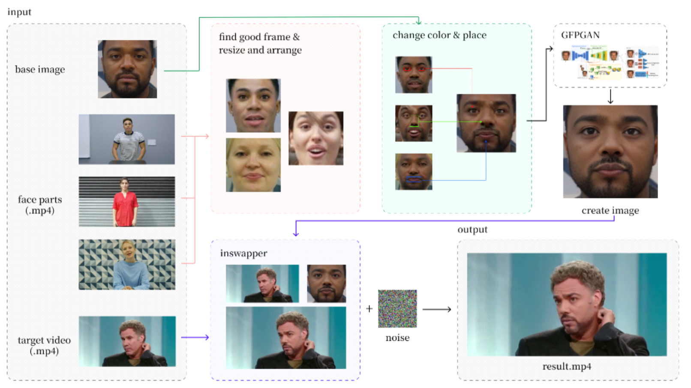

# deepfake-4parts-model

## 성균관대학교X한국정보과학회 딥페이크 경진대회

> 여러 사람의 얼굴 부위(얼굴, 눈, 코, 입) 파츠를 추출 후, 새로운 얼굴을 구성하여 타깃 영상 속 얼굴을 교체하는 모듈형 딥페이크 생성 파이프라인

---

## 📌 개요

이 프로젝트는 **눈, 코, 입, 얼굴형**의 4가지 주요 얼굴 부위를 서로 다른 사람의 이미지에서 추출하여 하나의 합성 얼굴을 생성하고, 해당 얼굴을 타깃 영상 속 인물에 삽입합니다.

실제 인물의 얼굴 전체를 사용하는 기존 딥페이크 방식과 달리, 이 방식은 **개인의 식별 정보 노출을 최소화**하면서도 자연스러운 고화질 영상을 생성할 수 있도록 설계되었습니다.

---

## 📂 데이터셋

아래 Kaggle 대회의 환경에서 제공하는 데이터셋입니다:  
[🔗 Deepfake Detection and Generation Challenge (Red Team) – Kaggle](https://www.kaggle.com/competitions/Deepfake_Detection_and_Generation_Challenge_Red_Team)

해당 데이터는 **FaceForensics++ Dataset** 기반으로 제작되었으며,  
원본 데이터는 아래 구글 폼을 통해 신청 후 다운로드하실 수 있습니다:  
[📝 FaceForensics++ 다운로드 신청 폼](https://docs.google.com/forms/d/e/1FAIpQLSdRRR3L5zAv6tQ_CKxmK4W96tAab_pfBu2EKAgQbeDVhmXagg/viewform)

---

## 🛠️ 처리 과정

1. **입력**
   - 타깃 영상 (.mp4, 교체 대상)

2. **얼굴 파트 선택**
   - 타깃 영상에서 정면 · 눈 뜨고 · 입 다문 프레임을 추출
   - 얼굴 정렬 및 랜드마크 추출 수행

3. **이미지 복원**
   - 얼굴 파츠 이미지에 GFPGAN 적용하여 해상도 및 디테일 복원

4. **색상 정규화 및 부위 배치**
   - 서로 다른 인물의 눈, 코, 입 파츠를 선택하여 얼굴형에 배치
   - 피부색 정규화 및 경계 자연화
   - 파츠 결합 후 다시 GFPGAN으로 보정

5. **얼굴 교체**
   - InsightFace의 inswapper를 이용해 타깃 영상의 얼굴을 합성 얼굴로 교체

6. **탐지 방지용 노이즈 추가 (선택)**
   - 딥페이크 탐지 교란용 미세 노이즈 삽입

7. **출력**
   - 최종 출력 영상은 `0001_0003_0324_0119.mp4` 형식으로 저장
   - 파일명은 조합된 얼굴 파츠의 출처 ID를 의미하며, 다음과 같은 방식으로 구성됨:
     - `0001`: 얼굴 기본 형태 (face base)
     - `0003`: 눈 (eyes)
     - `0324`: 코 (nose)
     - `0119`: 입 (mouth)
   - 예: `0001_0003_0324_0119.mp4` → 0001번 인물 얼굴형 + 0003의 눈 + 0324의 코 + 0119의 입

---

## 💻 담당 파트

- 얼굴 정렬 로직 구현 (정면 + 눈 뜨고 + 입 닫은 프레임 자동 추출)
- 전체 딥페이크 생성 비디오 파이프라인 제작
- YOLO 얼굴 검출 실패 시, MTCNN으로 대체 처리 구현
- Kaggle 오프라인 환경 대응:
  - 외부 인터넷 없이도 실행 가능한 구조로 패키지, 모델 의존성 정리 및 관리

---

## 🔒 활용 목적

- 개인 식별을 제거한 **프라이버시 보호형 콘텐츠** 생성
- 아바타/익명화 콘텐츠 제작
- 얼굴 합성 기술의 연구 및 실험용 데이터 생성

---

## ✨ 결과

- 식별 불가능한 새로운 얼굴 생성  
- 자연스럽고 고화질의 비디오 출력  
- 딥페이크 탐지 회피 기능 포함 (노이즈 추가)

